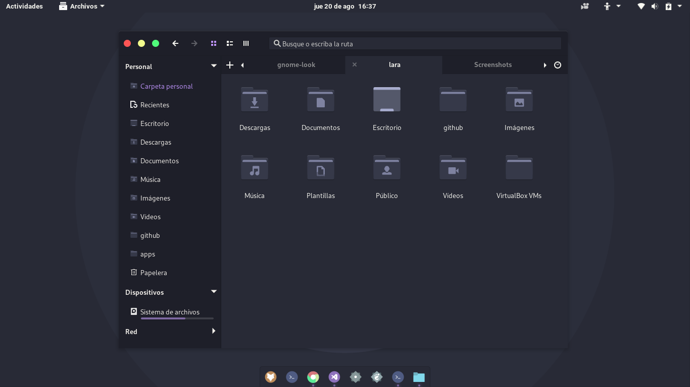

# Dracula for [GTK](https://www.gtk.org/)

> A dark theme for [GTK](https://www.gtk.org/).

This theme provides support for GTK-3 and GTK-2 based desktop environments like Gnome, Unity, Budgie, Pantheon, XFCE, Mate, etc...

**Support for KDE Plasma is also provided.**

---

#### NVIDIA GPU-Based Systems and KDE Plamsa

If you're using an NVIDIA GPU, along with NVIDIA's proprietary drivers, please note that NVIDIA's proprietary compositing pipeline will yeild the best rests and the least amount of adverse bugs and glitches. The pipeline should have been installed by the drivers on install. So chances are, if you're already using NVIDIA's proprietary drivers, you already have installed. **Therefore, if you're using KDE Plasma, it is recommended you turn off compositing.** This can be done at any time with `SHITFT` + `ALT` + `F12` or `qdbus org.kde.KWin /Compositor suspend` (and `qdbus org.kde.KWin /Compositor resume` to re-enable). Compositing can also be turned off, so that it doesn't get started up at start-up anymore by unchecking the option located at System Settings > Display and Monitor > Compositor > Enable compositor at startup.

## Install

All instructions can be found at [draculatheme.com/gtk](https://draculatheme.com/gtk).

## Team

This theme is maintained by the following person(s) and a bunch of [awesome contributors](https://github.com/dracula/gtk/graphs/contributors).

 | 
--- | 
[Eliver Lara](https://github.com/EliverLara) | 

## License

[GPL-3.0 License](./LICENSE)
