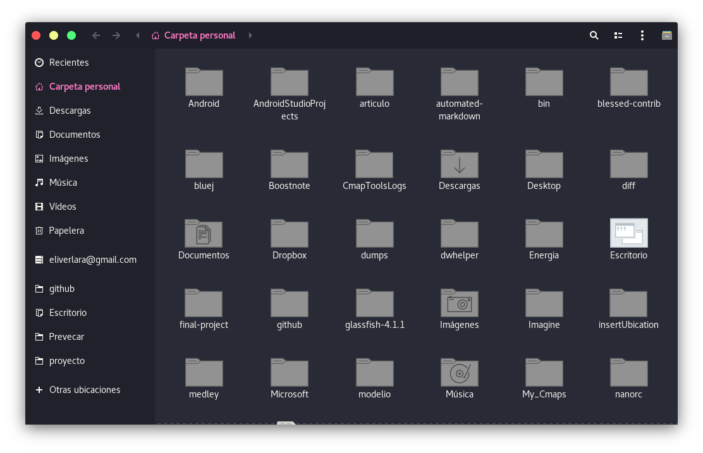

#### Installation

Extract the zip file to the themes directory i.e. `/usr/share/themes/` or `~/.themes/` (create it  if necessary).

To set the theme in Gnome, run the following commands in Terminal,

```
gsettings set org.gnome.desktop.interface gtk-theme "Ant-Dracula"
gsettings set org.gnome.desktop.wm.preferences theme "Ant-Dracula"
```
or Change via distribution specific tool.

### Note:
* This theme is based on the [evopop-gtk-theme](https://github.com/solus-project/evopop-gtk-theme).