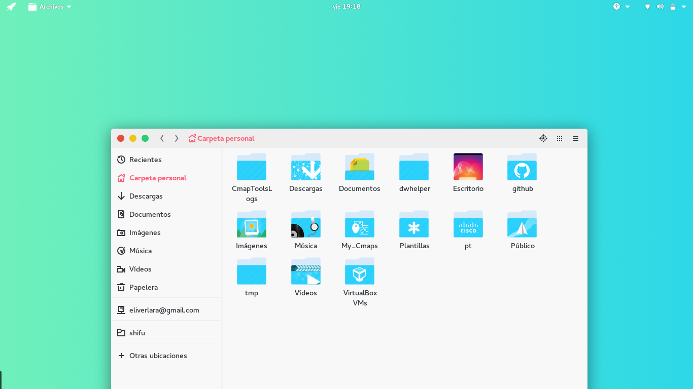
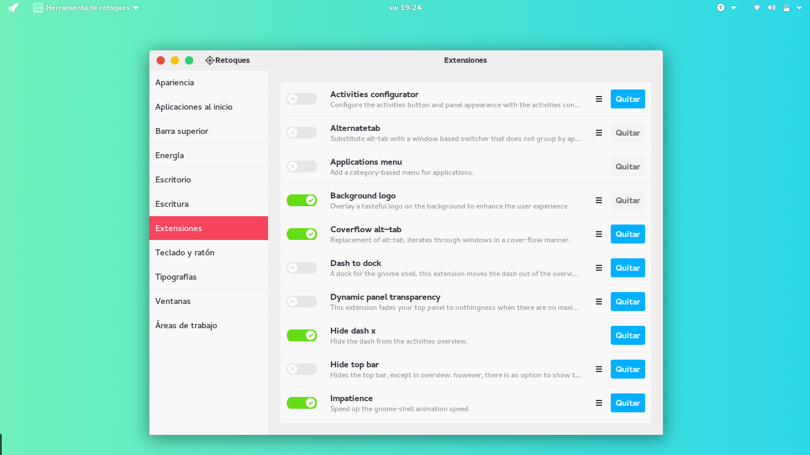

## Ant
A flat and light theme with a modern look






#### Installation

Extract the zip file to the themes directory i.e. `/usr/share/themes/` or `~/.themes/` (create it  if necessary).

To set the theme in Gnome, run the following commands in Terminal,

```
gsettings set org.gnome.desktop.interface gtk-theme "Ant"
gsettings set org.gnome.desktop.wm.preferences theme "Ant"
```
or Change via distribution specific tool.
